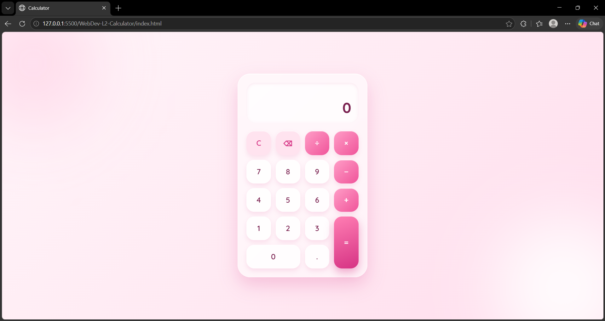
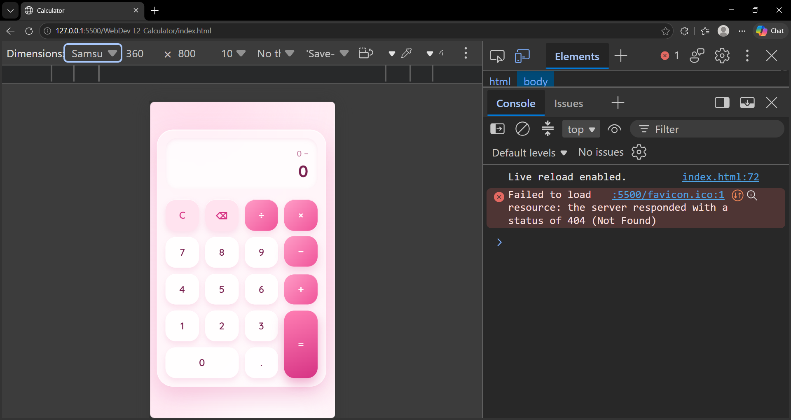

# Calculator

A responsive calculator with a soft pink glassmorphism design, built as part of the **Oasis Infobyte Web Development Internship (Level 2)**.

## Features
- Addition, subtraction, multiplication and division
- Decimal number support (only one decimal point per number)
- Clear (C) and delete (⌫) buttons
- Chained calculations (for example, `2 + 3 × 4`)
- Replaces the operator if two are pressed in a row
- Divide-by-zero error handling
- Fixes floating-point errors (`0.1 + 0.2` shows `0.3`)
- Responsive layout for desktop and mobile

## Technologies Used
- HTML5
- CSS3 (Grid, Flexbox, glassmorphism with `backdrop-filter`, CSS variables)
- JavaScript (DOM manipulation, event listeners, `data-` attributes)

## Project Structure
```
WebDev-L2-Calculator/
├── screenshots/
│   ├── desktop.png
│   └── mobile.png
├── index.html
├── style.css
├── script.js
└── README.md
```

## How to Run
1. Clone the repository:
   `git clone https://github.com/varshakumari87/OIBSIP.git`
2. Open the `WebDev-L2-Calculator` folder
3. Open `index.html` in any browser (or use the Live Server extension in VS Code)

## Screenshots

### Desktop View


### Mobile View


## Credits
- Font: Quicksand, via Google Fonts

## Author
**Varsha Kumari**
Web Development Intern, Oasis Infobyte