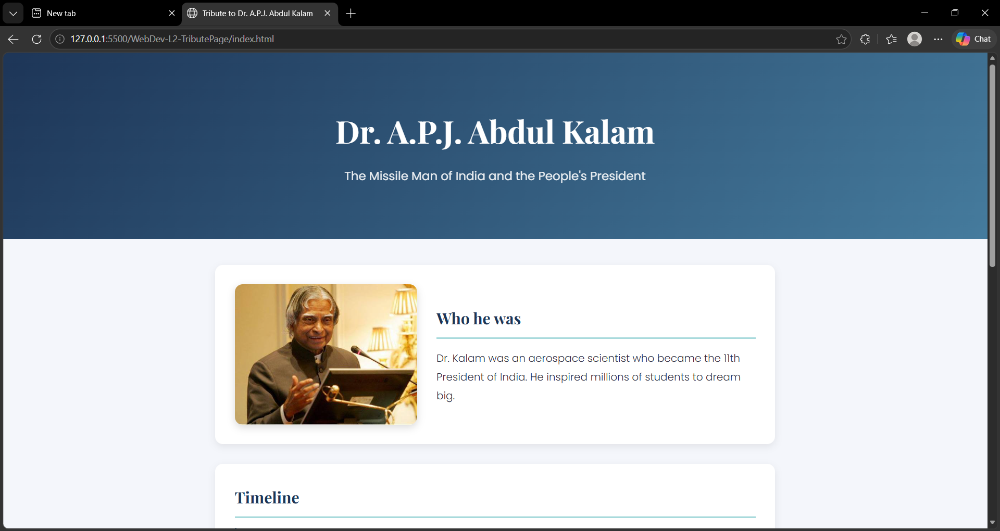
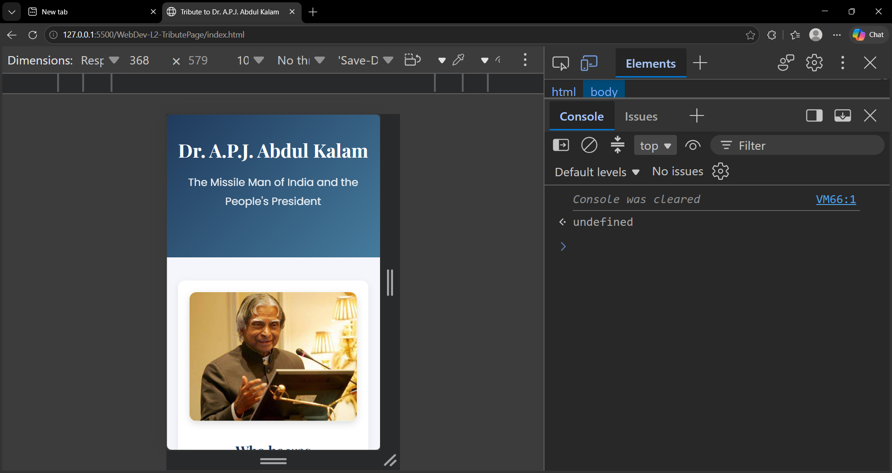
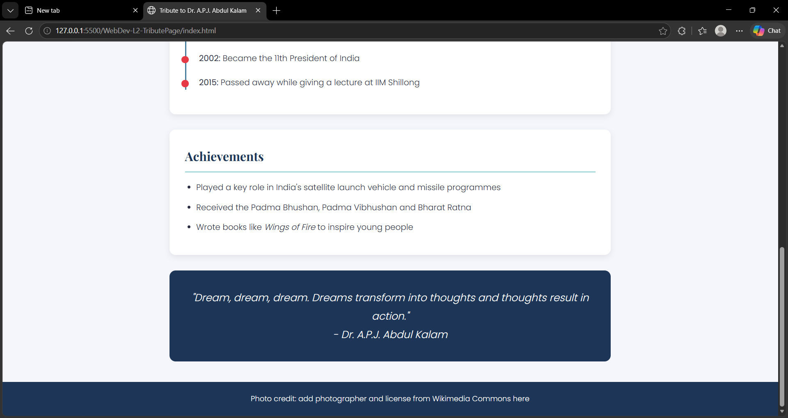

# Tribute Page: Dr. A.P.J. Abdul Kalam

A responsive tribute page honoring Dr. A.P.J. Abdul Kalam, built as part of the **Oasis Infobyte Web Development Internship (Level 2)**.

## Features
- Header with name and tagline
- Side-by-side photo and introduction
- Timeline of key events in his life
- Achievements section
- Inspirational quote
- Smooth fade-in animations on scroll
- Custom Google Fonts (Playfair Display and Poppins)
- Fully responsive design for desktop, tablet and mobile

## Technologies Used
- HTML5
- CSS3 (Flexbox, CSS variables, media queries, transitions)
- JavaScript (Intersection Observer API for scroll animations)

## Project Structure
```
WebDev-L2-TributePage/
├── images/
│   └── image2.jpeg
├── screenshots/
│   ├── home.png
│   └── mobile.png
├── index.html
├── style.css
├── script.js
└── README.md
```

## How to Run
1. Clone the repository:
   `git clone https://github.com/varshakumari87/OIBSIP.git`
2. Open the `WebDev-L2-TributePage` folder
3. Open `index.html` in any browser (or use the Live Server extension in VS Code)

## Screenshots

### Desktop View


### Mobile View


### More Sections


## Credits
- Photo: [fill in the real photographer and license]
- Information sourced from Wikipedia and other public sources
- Reference: "APJ Abdul Kalam - Made in India: A Student Tribute" by Samridh Kapoor, Monk Prayogshala (2015)
- Fonts: Google Fonts

## Author
**Varsha Kumari**
Web Development Intern, Oasis Infobyte